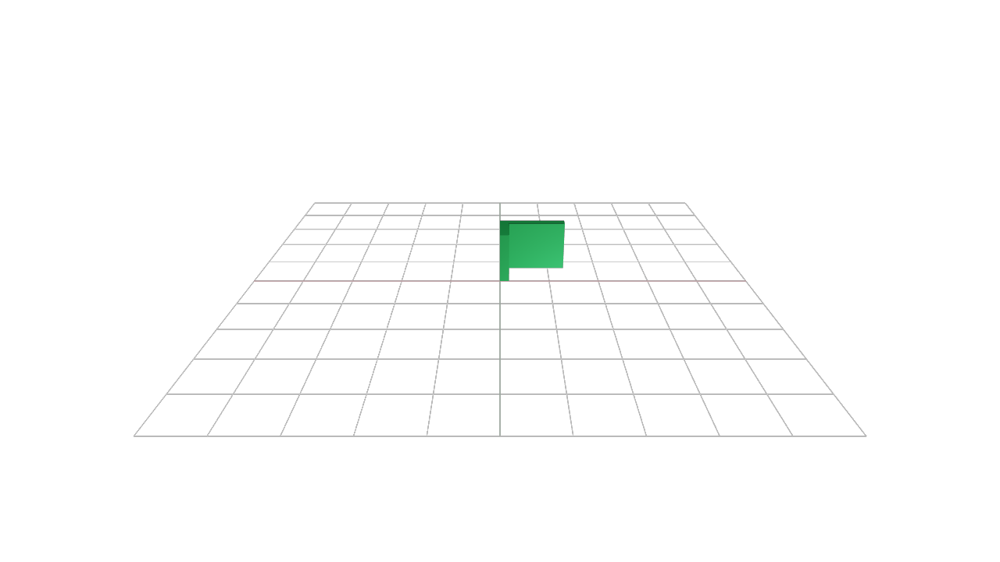
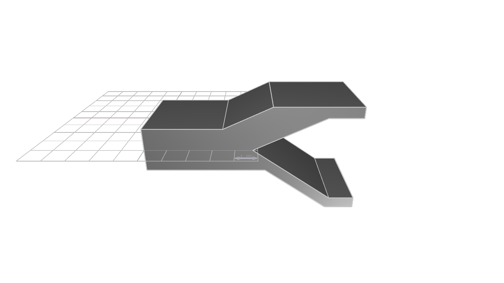
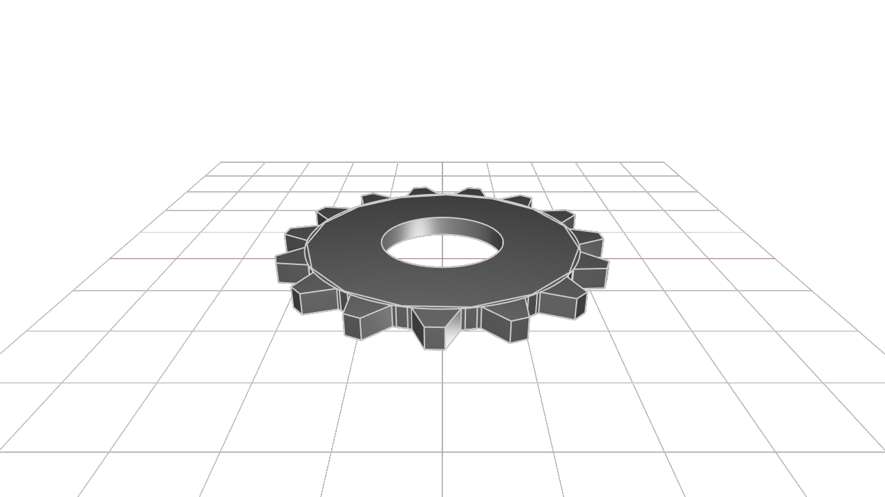
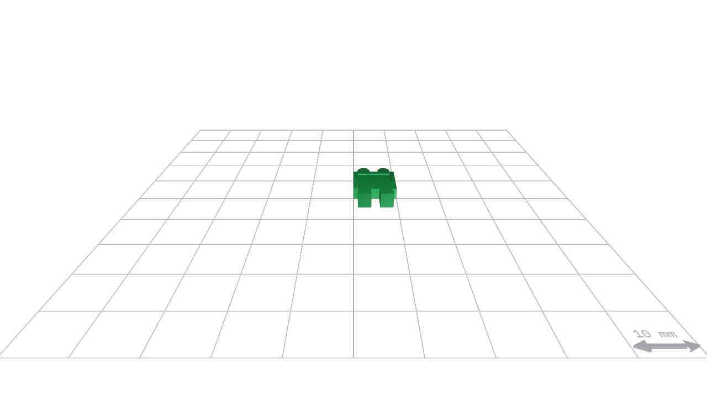
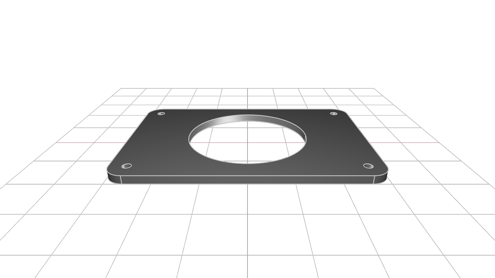

# kcl-samples
KCL sample files.

---
#### [bracket](OBJ-output-of-samples/bracket.obj)

#### [constrained-y](OBJ-output-of-samples/constrained-y.obj)

#### [gear](OBJ-output-of-samples/gear.obj)

#### [kitt](OBJ-output-of-samples/kitt.obj)

#### [mounting-plate](OBJ-output-of-samples/mounting-plate.obj)

