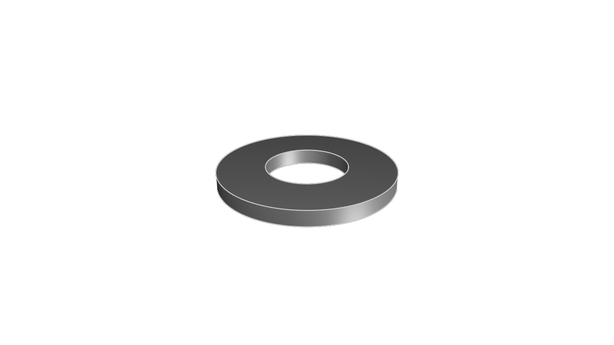

# kcl-samples

KittyCAD Language (KCL) is our language for defining geometry and working with our Geometry Engine efficiently.

This repository includes a mixture of simple and complex models demonstrating the features and syntax of KCL.

The samples can be browsed in our documentation at <https://zoo.dev/docs/kcl-samples>.

## Guidelines for adding samples

KCL samples conform to a set of style guidelines to ensure consistency and readability.

1. **File Naming:** Name your KCL files descriptively and concisely, using hyphens to separate words (e.g., flange.kcl, ball-bearing.kcl).

2. **File Header:** Include a title comment at the top of each file, followed by a brief description explaining what the model is and its typical use cases.

3. **Inline Comments:** Use inline comments to explain non-obvious parts of the code. Each major section should have a comment describing its purpose.

4. **Constants:** Define constants at the beginning of your KCL files for any values that might change or need to be reused (e.g., dimensions, angles).

## Snapshot and export

When you submit a PR to add or modify KCL samples, images and STEP files will be generated and added to the repository automatically.

---
#### [80-20-rail](./80-20-rail/main.kcl) ([step](step/main.step)) ([screenshot](screenshots/main.png))

#### [a-parametric-bearing-pillow-block](./a-parametric-bearing-pillow-block/main.kcl) ([step](step/main.step)) ([screenshot](screenshots/main.png))

#### [ball-bearing](./ball-bearing/main.kcl) ([step](step/main.step)) ([screenshot](screenshots/main.png))

#### [bracket](./bracket/main.kcl) ([step](step/main.step)) ([screenshot](screenshots/main.png))

#### [dodecahedron](./dodecahedron/main.kcl) ([step](step/main.step)) ([screenshot](screenshots/main.png))

#### [enclosure](./enclosure/main.kcl) ([step](step/main.step)) ([screenshot](screenshots/main.png))

#### [flange-with-patterns](./flange-with-patterns/main.kcl) ([step](step/main.step)) ([screenshot](screenshots/main.png))

#### [flange-xy](./flange-xy/main.kcl) ([step](step/main.step)) ([screenshot](screenshots/main.png))

#### [focusrite-scarlett-mounting-bracket](./focusrite-scarlett-mounting-bracket/main.kcl) ([step](step/main.step)) ([screenshot](screenshots/main.png))

#### [food-service-spatula](./food-service-spatula/main.kcl) ([step](step/main.step)) ([screenshot](screenshots/main.png))

#### [french-press](./french-press/main.kcl) ([step](step/main.step)) ([screenshot](screenshots/main.png))

#### [gear](./gear/main.kcl) ([step](step/main.step)) ([screenshot](screenshots/main.png))

#### [gear-rack](./gear-rack/main.kcl) ([step](step/main.step)) ([screenshot](screenshots/main.png))

#### [hex-nut](./hex-nut/main.kcl) ([step](step/main.step)) ([screenshot](screenshots/main.png))

#### [i-beam](./i-beam/main.kcl) ([step](step/main.step)) ([screenshot](screenshots/main.png))

#### [kitt](./kitt/main.kcl) ([step](step/main.step)) ([screenshot](screenshots/main.png))

#### [lego](./lego/main.kcl) ([step](step/main.step)) ([screenshot](screenshots/main.png))

#### [mounting-plate](./mounting-plate/main.kcl) ([step](step/main.step)) ([screenshot](screenshots/main.png))

#### [multi-axis-robot](./multi-axis-robot/main.kcl) ([step](step/main.step)) ([screenshot](screenshots/main.png))

#### [pipe](./pipe/main.kcl) ([step](step/main.step)) ([screenshot](screenshots/main.png))

#### [pipe-flange-assembly](./pipe-flange-assembly/main.kcl) ([step](step/main.step)) ([screenshot](screenshots/main.png))

#### [pipe-with-bend](./pipe-with-bend/main.kcl) ([step](step/main.step)) ([screenshot](screenshots/main.png))

#### [poopy-shoe](./poopy-shoe/main.kcl) ([step](step/main.step)) ([screenshot](screenshots/main.png))

#### [router-template-cross-bar](./router-template-cross-bar/main.kcl) ([step](step/main.step)) ([screenshot](screenshots/main.png))

#### [router-template-slate](./router-template-slate/main.kcl) ([step](step/main.step)) ([screenshot](screenshots/main.png))

#### [sheet-metal-bracket](./sheet-metal-bracket/main.kcl) ([step](step/main.step)) ([screenshot](screenshots/main.png))

#### [socket-head-cap-screw](./socket-head-cap-screw/main.kcl) ([step](step/main.step)) ([screenshot](screenshots/main.png))

#### [washer](./washer/main.kcl) ([step](step/main.step)) ([screenshot](screenshots/main.png))

