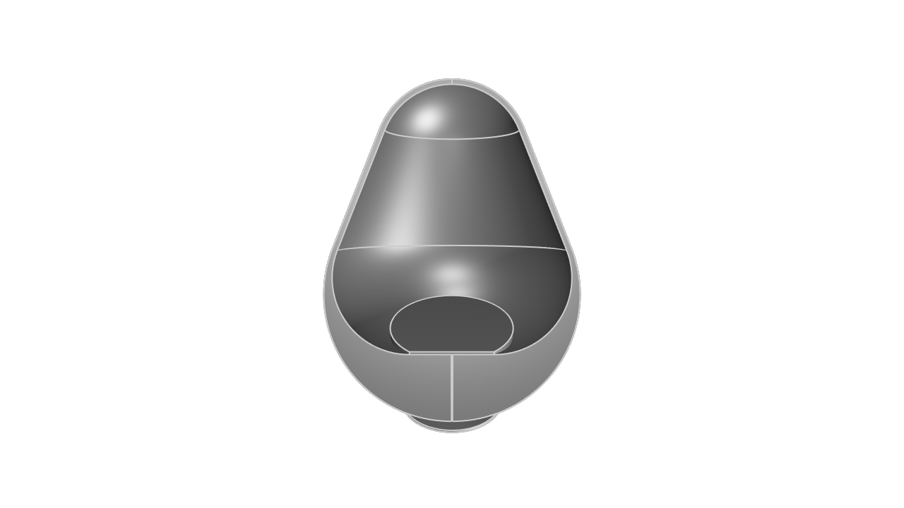

# kcl-samples

KittyCAD Language (KCL) is our language for defining geometry and working with our Geometry Engine efficiently.

This repository includes a mixture of simple and complex models demonstrating the features and syntax of KCL.

The samples can be browsed in our documentation at <https://zoo.dev/docs/kcl-samples>.

## Guidelines for adding samples

KCL samples conform to a set of style guidelines to ensure consistency and readability.

1. **File Naming:** Name your KCL files descriptively and concisely, using hyphens to separate words (e.g., flange.kcl, ball-bearing.kcl).

2. **File Header:** Include a title comment at the top of each file, followed by a brief description explaining what the model is and its typical use cases.

3. **Inline Comments:** Use inline comments to explain non-obvious parts of the code. Each major section should have a comment describing its purpose.

4. **Constants:** Define constants at the beginning of your KCL files for any values that might change or need to be reused (e.g., dimensions, angles).

## Snapshot and export

When you submit a PR to add or modify KCL samples, images and STEP files will be generated and added to the repository automatically.

---
#### [avocado-chair](avocado-chair.kcl) ([step](step/avocado-chair.step)) ([screenshot](screenshots/avocado-chair.png))

