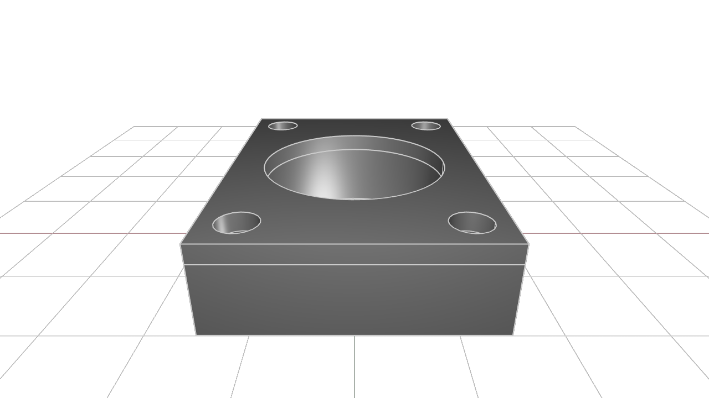
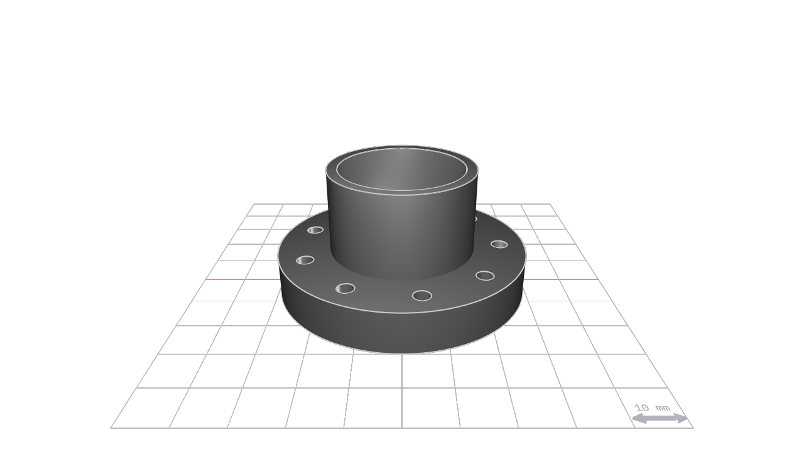
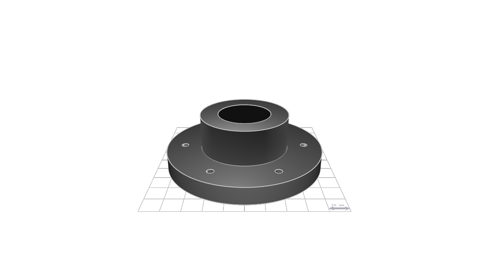
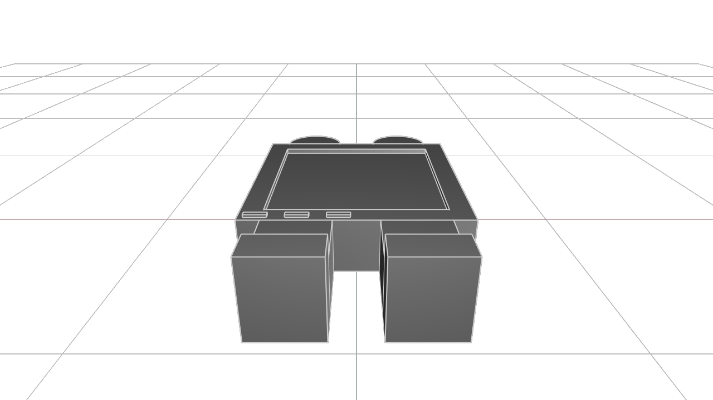
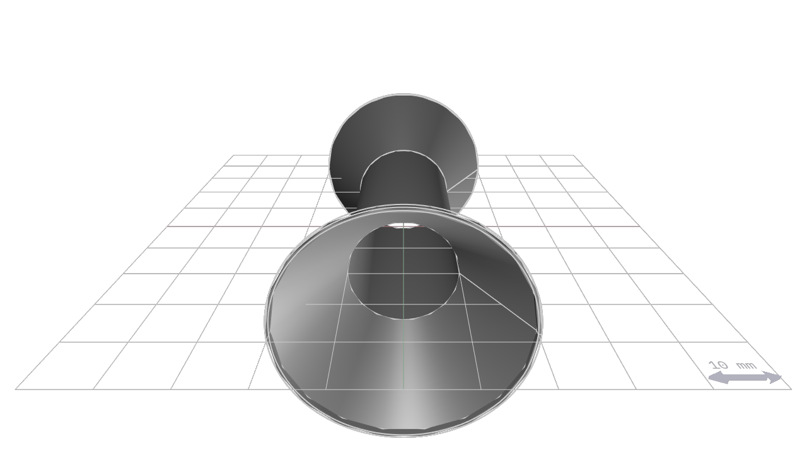

# kcl-samples

KittyCAD Language (KCL) is our language for defining geometry and working with our Geometry Engine efficiently.

This repository includes a mixture of simple and complex models demonstrating the features and syntax of KCL.

The samples can be browsed in our documentation at <https://zoo.dev/docs/kcl-samples>.

## Guidelines for adding samples

KCL samples conform to a set of style guidelines to ensure consistency and readability.

1. **File Naming:** Name your KCL files descriptively and concisely, using hyphens to separate words (e.g., flange.kcl, ball-bearing.kcl).

2. **File Header:** Include a title comment at the top of each file, followed by a brief description explaining what the model is and its typical use cases.

3. **Inline Comments:** Use inline comments to explain non-obvious parts of the code. Each major section should have a comment describing its purpose.

4. **Constants:** Define constants at the beginning of your KCL files for any values that might change or need to be reused (e.g., dimensions, angles).

## Snapshot and export

When you submit a PR to add or modify KCL samples, images and STEP files will be generated and added to the repository automatically.

---
#### [a-parametric-bearing-pillow-block](STEP-output-of-samples/a-parametric-bearing-pillow-block.step)

#### [ball-bearing](STEP-output-of-samples/ball-bearing.step)

#### [bracket](STEP-output-of-samples/bracket.step)

#### [constrained-y](STEP-output-of-samples/constrained-y.step)

#### [flange-with-patterns](STEP-output-of-samples/flange-with-patterns.step)

#### [flange-xy](STEP-output-of-samples/flange-xy.step)

#### [gear](STEP-output-of-samples/gear.step)

#### [gear_rack](STEP-output-of-samples/gear_rack.step)

#### [hex-nut](STEP-output-of-samples/hex-nut.step)

#### [kitt](STEP-output-of-samples/kitt.step)

#### [lego](STEP-output-of-samples/lego.step)

#### [mounting-plate](STEP-output-of-samples/mounting-plate.step)

#### [pipe-flange-assembly](STEP-output-of-samples/pipe-flange-assembly.step)

#### [pipe](STEP-output-of-samples/pipe.step)

#### [sheet-metal-bracket](STEP-output-of-samples/sheet-metal-bracket.step)

#### [socket-head-cap-screw](STEP-output-of-samples/socket-head-cap-screw.step)

#### [washer](STEP-output-of-samples/washer.step)

