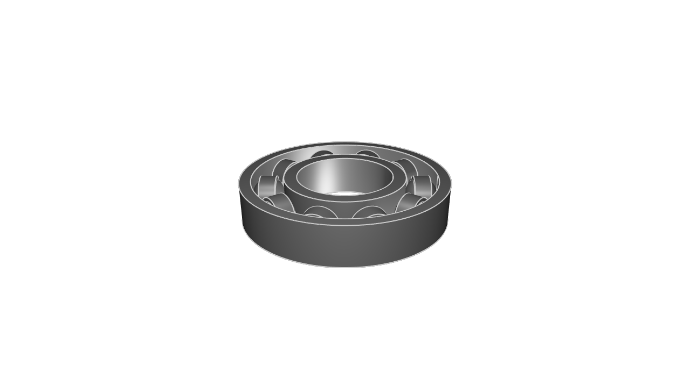
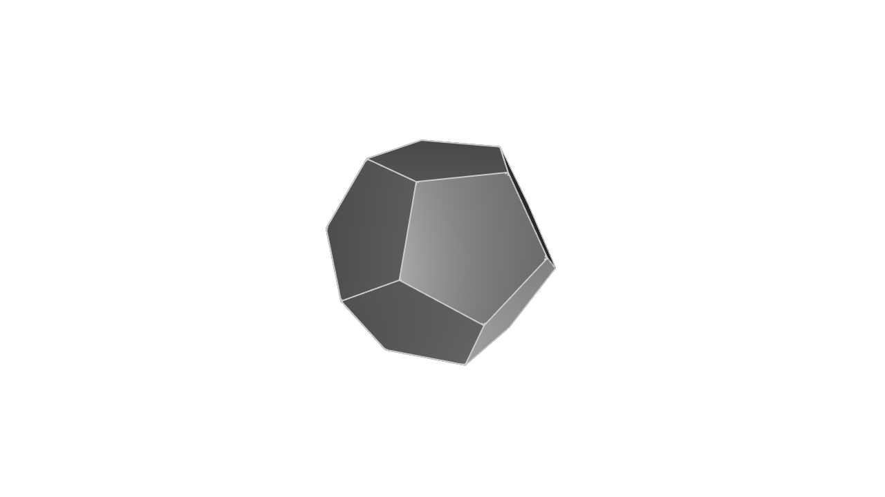
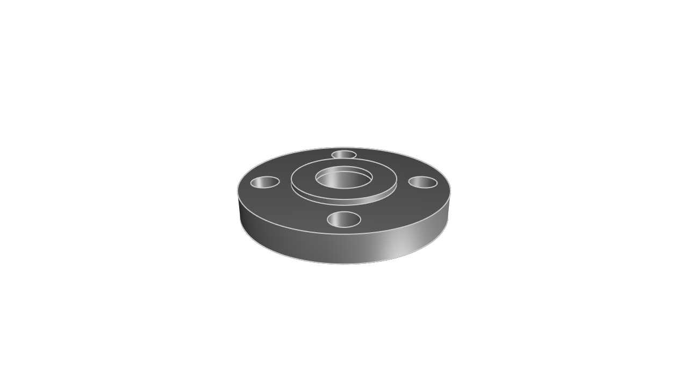
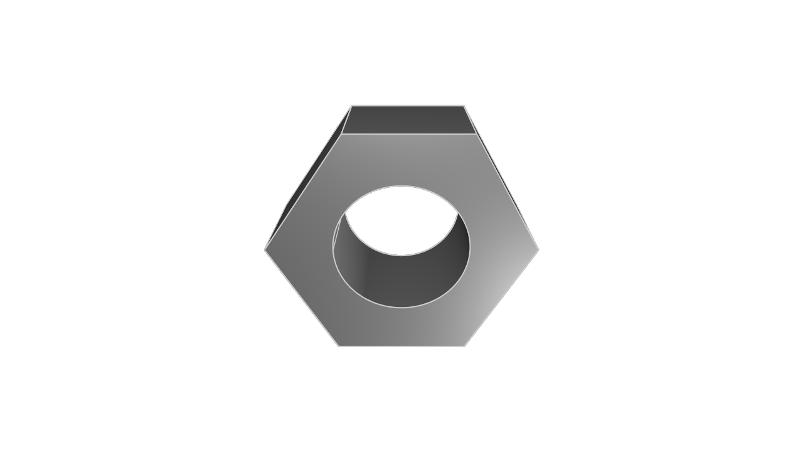
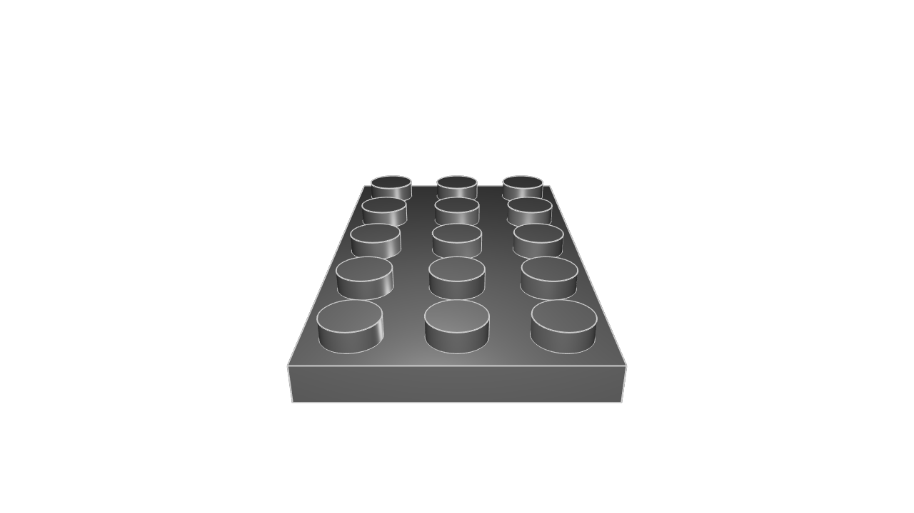
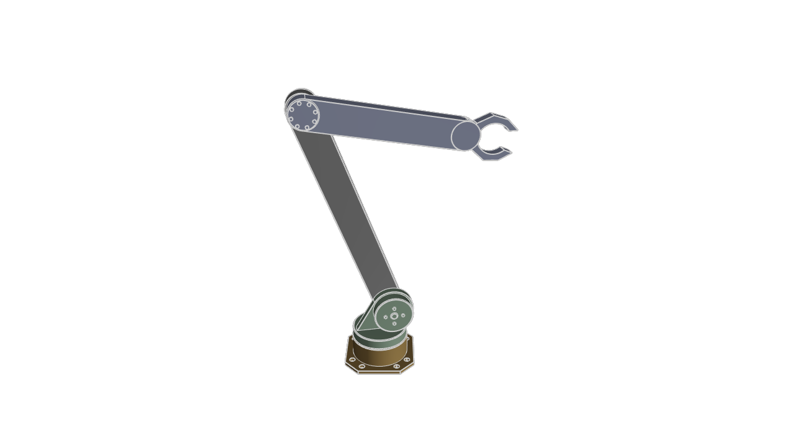
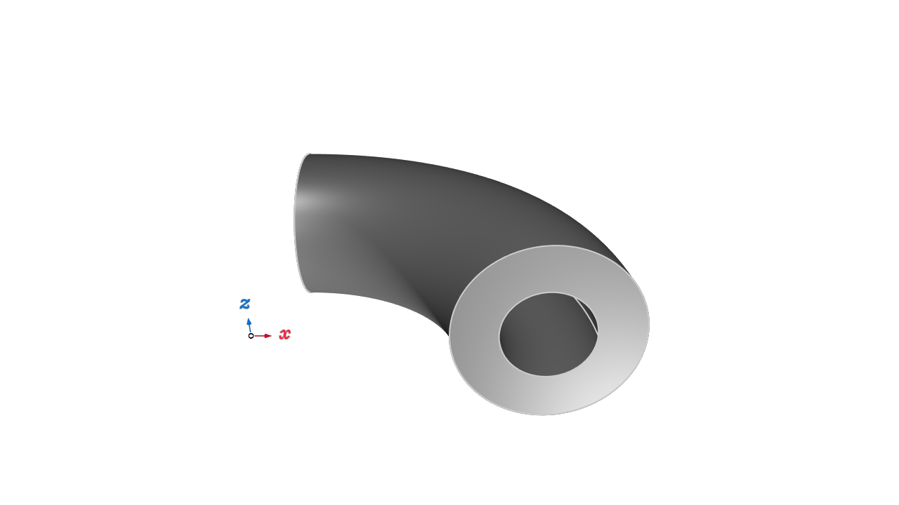
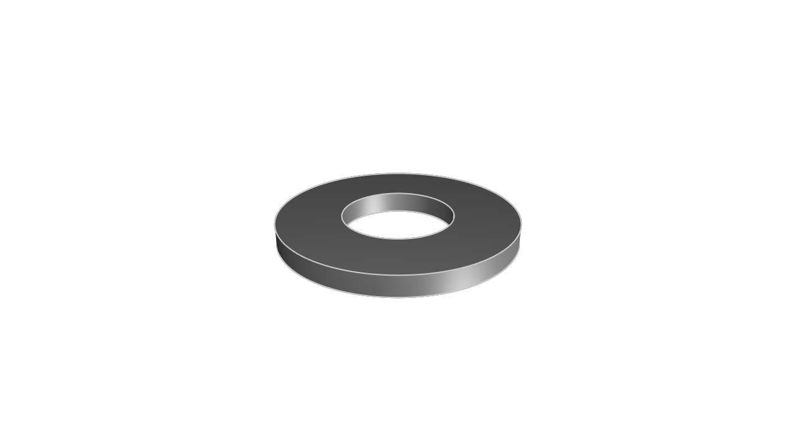

# kcl-samples

KittyCAD Language (KCL) is our language for defining geometry and working with our Geometry Engine efficiently.

This repository includes a mixture of simple and complex models demonstrating the features and syntax of KCL.

The samples can be browsed in our documentation at <https://zoo.dev/docs/kcl-samples>.

## Guidelines for adding samples

Merge PRs to the `next` branch, not main. When we release Modeling App, we will merge this repo's `next` into `main`. This way, `main` is always compatible with the latest ZMA release.

KCL samples conform to a set of style guidelines to ensure consistency and readability.

1. **File Naming:** Name your KCL files descriptively and concisely, using hyphens to separate words (e.g., flange.kcl, ball-bearing.kcl).

2. **File Header:** Include a title comment at the top of each file, followed by a brief description explaining what the model is and its typical use cases.

3. **Inline Comments:** Use inline comments to explain non-obvious parts of the code. Each major section should have a comment describing its purpose.

4. **Constants:** Define constants at the beginning of your KCL files for any values that might change or need to be reused (e.g., dimensions, angles).

## Snapshot and export

When you submit a PR to add or modify KCL samples, images and STEP files will be generated and added to the repository automatically.

---
#### [a-parametric-bearing-pillow-block](a-parametric-bearing-pillow-block/main.kcl) ([step](step/a-parametric-bearing-pillow-block.step)) ([screenshot](screenshots/a-parametric-bearing-pillow-block.png))

#### [ball-bearing](ball-bearing/main.kcl) ([step](step/ball-bearing.step)) ([screenshot](screenshots/ball-bearing.png))

#### [bracket](bracket/main.kcl) ([step](step/bracket.step)) ([screenshot](screenshots/bracket.png))

#### [color-cube](color-cube/main.kcl) ([step](step/color-cube.step)) ([screenshot](screenshots/color-cube.png))

#### [cycloidal-gear](cycloidal-gear/main.kcl) ([step](step/cycloidal-gear.step)) ([screenshot](screenshots/cycloidal-gear.png))

#### [dodecahedron](dodecahedron/main.kcl) ([step](step/dodecahedron.step)) ([screenshot](screenshots/dodecahedron.png))

#### [enclosure](enclosure/main.kcl) ([step](step/enclosure.step)) ([screenshot](screenshots/enclosure.png))

#### [flange-with-patterns](flange-with-patterns/main.kcl) ([step](step/flange-with-patterns.step)) ([screenshot](screenshots/flange-with-patterns.png))

#### [flange-xy](flange-xy/main.kcl) ([step](step/flange-xy.step)) ([screenshot](screenshots/flange-xy.png))

#### [focusrite-scarlett-mounting-bracket](focusrite-scarlett-mounting-bracket/main.kcl) ([step](step/focusrite-scarlett-mounting-bracket.step)) ([screenshot](screenshots/focusrite-scarlett-mounting-bracket.png))

#### [gear-rack](gear-rack/main.kcl) ([step](step/gear-rack.step)) ([screenshot](screenshots/gear-rack.png))

#### [hex-nut](hex-nut/main.kcl) ([step](step/hex-nut.step)) ([screenshot](screenshots/hex-nut.png))

#### [kitt](kitt/main.kcl) ([step](step/kitt.step)) ([screenshot](screenshots/kitt.png))

#### [lego](lego/main.kcl) ([step](step/lego.step)) ([screenshot](screenshots/lego.png))

#### [mounting-plate](mounting-plate/main.kcl) ([step](step/mounting-plate.step)) ([screenshot](screenshots/mounting-plate.png))

#### [multi-axis-robot](multi-axis-robot/main.kcl) ([step](step/multi-axis-robot.step)) ([screenshot](screenshots/multi-axis-robot.png))

#### [pipe-with-bend](pipe-with-bend/main.kcl) ([step](step/pipe-with-bend.step)) ([screenshot](screenshots/pipe-with-bend.png))

#### [sheet-metal-bracket](sheet-metal-bracket/main.kcl) ([step](step/sheet-metal-bracket.step)) ([screenshot](screenshots/sheet-metal-bracket.png))

#### [washer](washer/main.kcl) ([step](step/washer.step)) ([screenshot](screenshots/washer.png))

