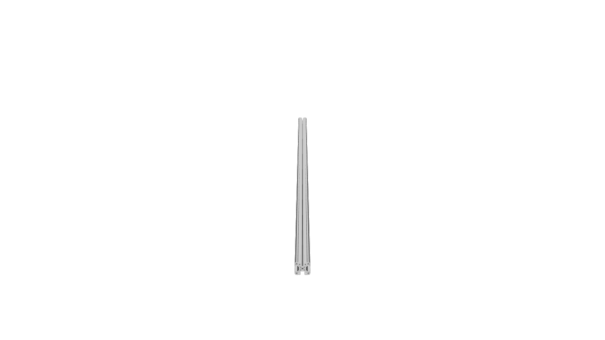
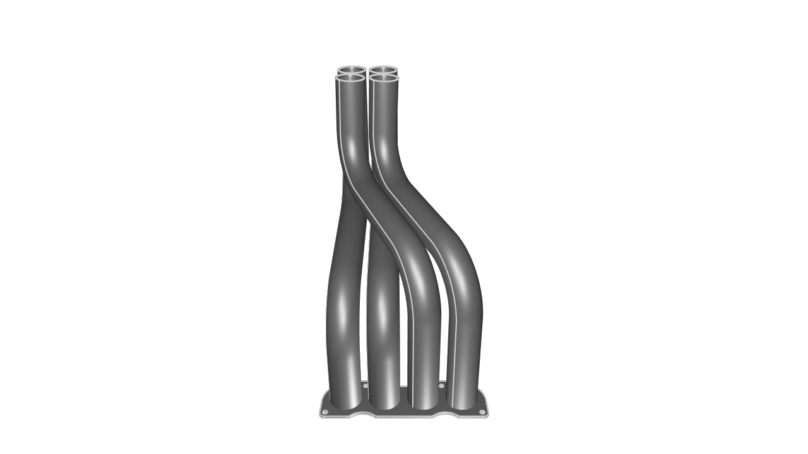
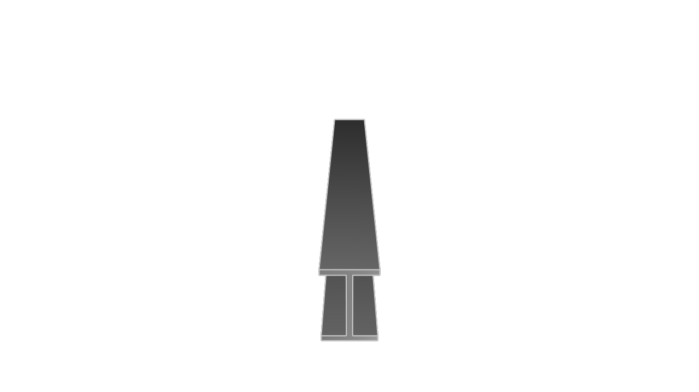
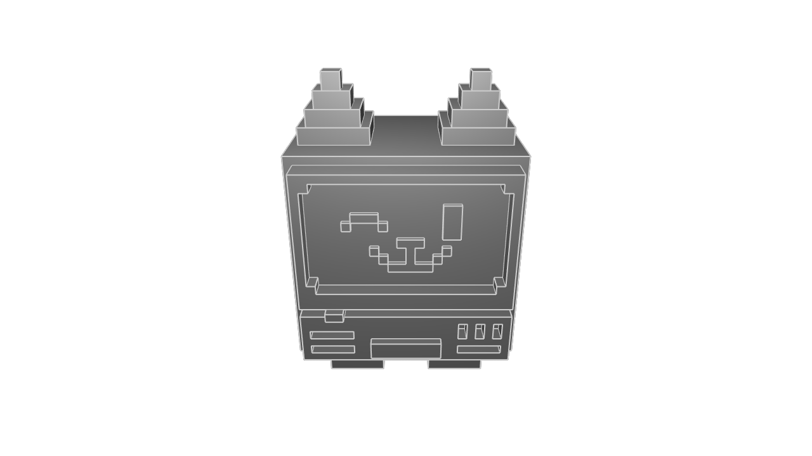
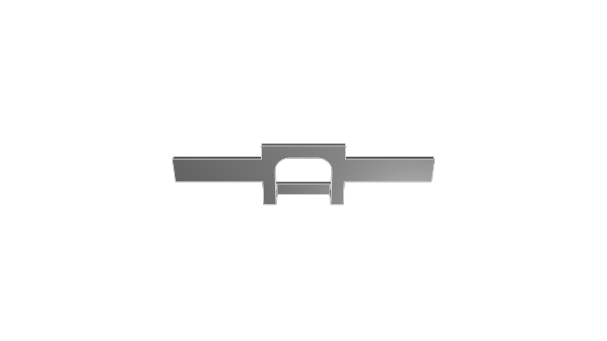
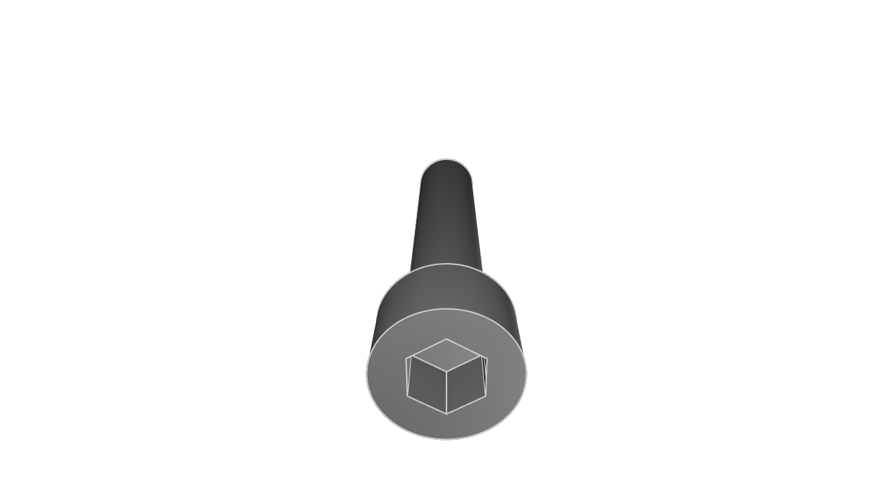

# kcl-samples

KittyCAD Language (KCL) is our language for defining geometry and working with our Geometry Engine efficiently.

This repository includes a mixture of simple and complex models demonstrating the features and syntax of KCL.

The samples can be browsed in our documentation at <https://zoo.dev/docs/kcl-samples>.

## Guidelines for adding samples

Merge PRs to the `next` branch, not main. When we release Modeling App, we will merge this repo's `next` into `main`. This way, `main` is always compatible with the latest ZMA release.

KCL samples conform to a set of style guidelines to ensure consistency and readability.

1. **File Naming:** Name your KCL files descriptively and concisely, using hyphens to separate words (e.g., flange.kcl, ball-bearing.kcl).

2. **File Header:** Include a title comment at the top of each file, followed by a brief description explaining what the model is and its typical use cases.

3. **Inline Comments:** Use inline comments to explain non-obvious parts of the code. Each major section should have a comment describing its purpose.

4. **Constants:** Define constants at the beginning of your KCL files for any values that might change or need to be reused (e.g., dimensions, angles).

## Snapshot and export

When you submit a PR to add or modify KCL samples, images and STEP files will be generated and added to the repository automatically.

---
#### [80-20-rail](80-20-rail/main.kcl) ([step](step/80-20-rail.step)) ([screenshot](screenshots/80-20-rail.png))

#### [a-parametric-bearing-pillow-block](a-parametric-bearing-pillow-block/main.kcl) ([step](step/a-parametric-bearing-pillow-block.step)) ([screenshot](screenshots/a-parametric-bearing-pillow-block.png))

#### [bracket](bracket/main.kcl) ([step](step/bracket.step)) ([screenshot](screenshots/bracket.png))

#### [enclosure](enclosure/main.kcl) ([step](step/enclosure.step)) ([screenshot](screenshots/enclosure.png))

#### [exhaust-manifold](exhaust-manifold/main.kcl) ([step](step/exhaust-manifold.step)) ([screenshot](screenshots/exhaust-manifold.png))

#### [flange-xy](flange-xy/main.kcl) ([step](step/flange-xy.step)) ([screenshot](screenshots/flange-xy.png))

#### [hex-nut](hex-nut/main.kcl) ([step](step/hex-nut.step)) ([screenshot](screenshots/hex-nut.png))

#### [i-beam](i-beam/main.kcl) ([step](step/i-beam.step)) ([screenshot](screenshots/i-beam.png))

#### [kitt](kitt/main.kcl) ([step](step/kitt.step)) ([screenshot](screenshots/kitt.png))

#### [mounting-plate](mounting-plate/main.kcl) ([step](step/mounting-plate.step)) ([screenshot](screenshots/mounting-plate.png))

#### [pipe-with-bend](pipe-with-bend/main.kcl) ([step](step/pipe-with-bend.step)) ([screenshot](screenshots/pipe-with-bend.png))

#### [pipe](pipe/main.kcl) ([step](step/pipe.step)) ([screenshot](screenshots/pipe.png))

#### [poopy-shoe](poopy-shoe/main.kcl) ([step](step/poopy-shoe.step)) ([screenshot](screenshots/poopy-shoe.png))

#### [router-template-cross-bar](router-template-cross-bar/main.kcl) ([step](step/router-template-cross-bar.step)) ([screenshot](screenshots/router-template-cross-bar.png))

#### [router-template-slate](router-template-slate/main.kcl) ([step](step/router-template-slate.step)) ([screenshot](screenshots/router-template-slate.png))

#### [sheet-metal-bracket](sheet-metal-bracket/main.kcl) ([step](step/sheet-metal-bracket.step)) ([screenshot](screenshots/sheet-metal-bracket.png))

#### [socket-head-cap-screw](socket-head-cap-screw/main.kcl) ([step](step/socket-head-cap-screw.step)) ([screenshot](screenshots/socket-head-cap-screw.png))

#### [washer](washer/main.kcl) ([step](step/washer.step)) ([screenshot](screenshots/washer.png))

