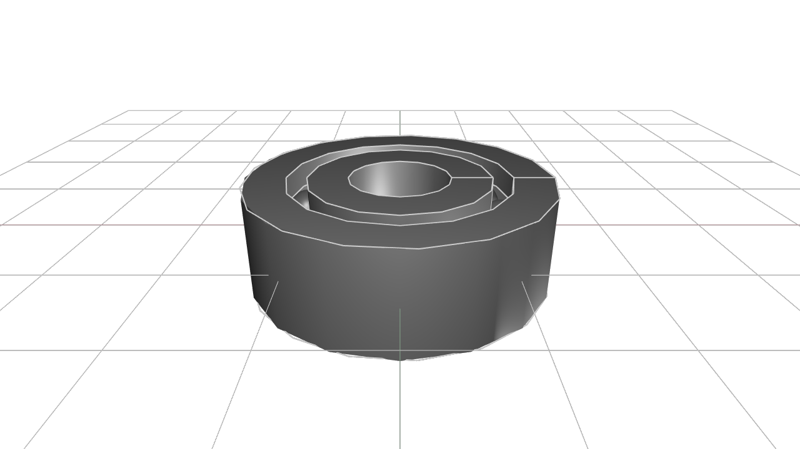
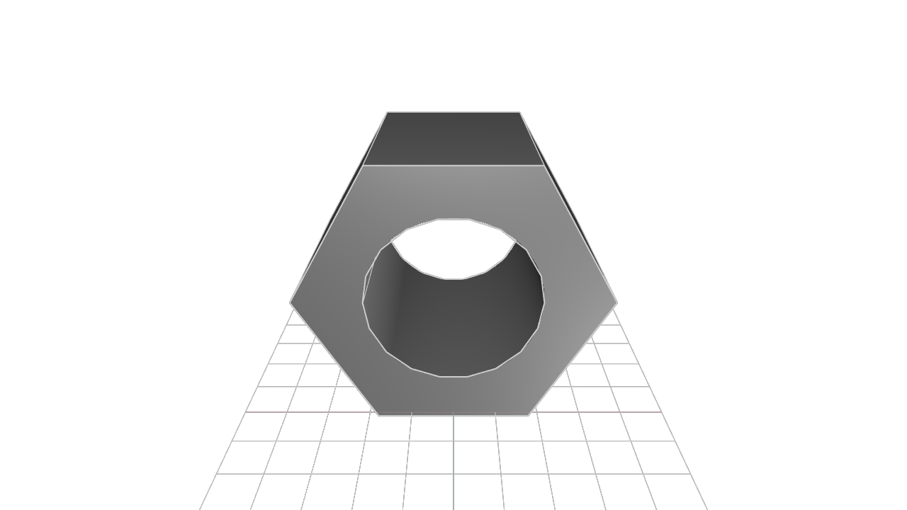
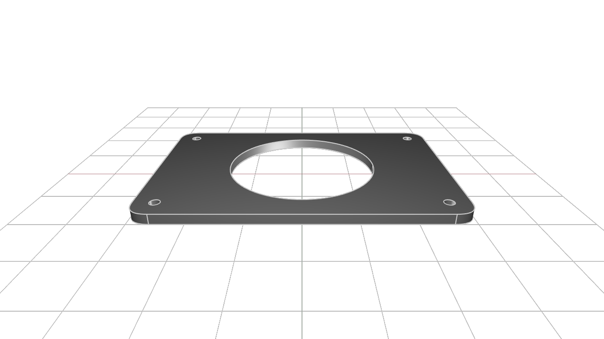

# kcl-samples

KittyCAD Language (KCL) is our language for defining geometry and working with our Geometry Engine efficiently.

This repository includes a mixture of simple and complex models demonstrating the features and syntax of KCL.

The samples can be browsed in our documentation at <https://zoo.dev/docs/kcl-samples>.

## Guidelines for adding samples

KCL samples conform to a set of style guidelines to ensure consistency and readability.

1. **File Naming:** Name your KCL files descriptively and concisely, using hyphens to separate words (e.g., flange.kcl, ball-bearing.kcl).

2. **File Header:** Include a title comment at the top of each file, followed by a brief description explaining what the model is and its typical use cases.

3. **Inline Comments:** Use inline comments to explain non-obvious parts of the code. Each major section should have a comment describing its purpose.

4. **Constants:** Define constants at the beginning of your KCL files for any values that might change or need to be reused (e.g., dimensions, angles).

## Snapshot and export

When you submit a PR to add or modify KCL samples, images and STEP files will be generated and added to the repository automatically.

---
#### [a-parametric-bearing-pillow-block](a-parametric-bearing-pillow-block.kcl) ([step](STEP-output-of-samples/a-parametric-bearing-pillow-block.step)) ([screenshot](screenshots-of-samples/a-parametric-bearing-pillow-block.png))

#### [ball-bearing](ball-bearing.kcl) ([step](STEP-output-of-samples/ball-bearing.step)) ([screenshot](screenshots-of-samples/ball-bearing.png))

#### [bracket](bracket.kcl) ([step](STEP-output-of-samples/bracket.step)) ([screenshot](screenshots-of-samples/bracket.png))

#### [constrained-y](constrained-y.kcl) ([step](STEP-output-of-samples/constrained-y.step)) ([screenshot](screenshots-of-samples/constrained-y.png))

#### [flange-with-patterns](flange-with-patterns.kcl) ([step](STEP-output-of-samples/flange-with-patterns.step)) ([screenshot](screenshots-of-samples/flange-with-patterns.png))

#### [flange-xy](flange-xy.kcl) ([step](STEP-output-of-samples/flange-xy.step)) ([screenshot](screenshots-of-samples/flange-xy.png))

#### [focusrite-scarlett-mounting-bracket](focusrite-scarlett-mounting-bracket.kcl) ([step](STEP-output-of-samples/focusrite-scarlett-mounting-bracket.step)) ([screenshot](screenshots-of-samples/focusrite-scarlett-mounting-bracket.png))

#### [gear](gear.kcl) ([step](STEP-output-of-samples/gear.step)) ([screenshot](screenshots-of-samples/gear.png))

#### [gear_rack](gear_rack.kcl) ([step](STEP-output-of-samples/gear_rack.step)) ([screenshot](screenshots-of-samples/gear_rack.png))

#### [hex-nut](hex-nut.kcl) ([step](STEP-output-of-samples/hex-nut.step)) ([screenshot](screenshots-of-samples/hex-nut.png))

#### [kitt](kitt.kcl) ([step](STEP-output-of-samples/kitt.step)) ([screenshot](screenshots-of-samples/kitt.png))

#### [lego](lego.kcl) ([step](STEP-output-of-samples/lego.step)) ([screenshot](screenshots-of-samples/lego.png))

#### [mounting-plate](mounting-plate.kcl) ([step](STEP-output-of-samples/mounting-plate.step)) ([screenshot](screenshots-of-samples/mounting-plate.png))

#### [pipe-flange-assembly](pipe-flange-assembly.kcl) ([step](STEP-output-of-samples/pipe-flange-assembly.step)) ([screenshot](screenshots-of-samples/pipe-flange-assembly.png))

#### [pipe](pipe.kcl) ([step](STEP-output-of-samples/pipe.step)) ([screenshot](screenshots-of-samples/pipe.png))

#### [sheet-metal-bracket](sheet-metal-bracket.kcl) ([step](STEP-output-of-samples/sheet-metal-bracket.step)) ([screenshot](screenshots-of-samples/sheet-metal-bracket.png))

#### [socket-head-cap-screw](socket-head-cap-screw.kcl) ([step](STEP-output-of-samples/socket-head-cap-screw.step)) ([screenshot](screenshots-of-samples/socket-head-cap-screw.png))

#### [washer](washer.kcl) ([step](STEP-output-of-samples/washer.step)) ([screenshot](screenshots-of-samples/washer.png))

