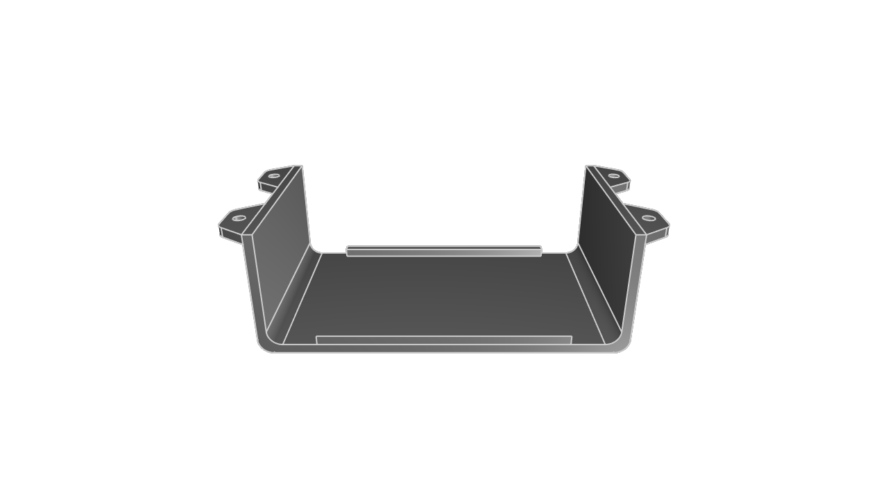
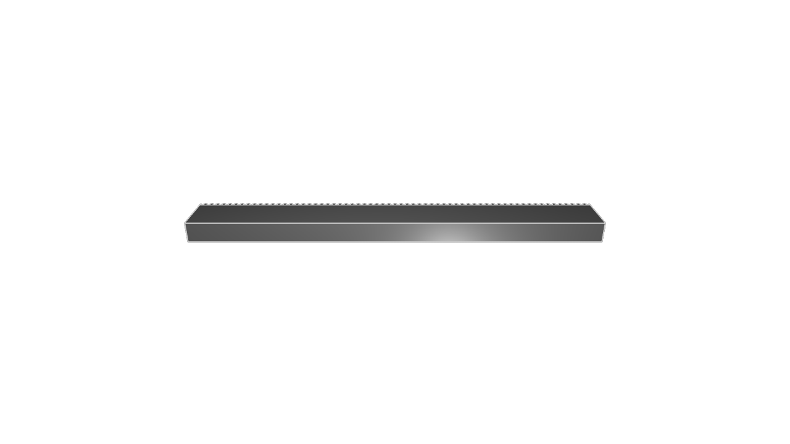
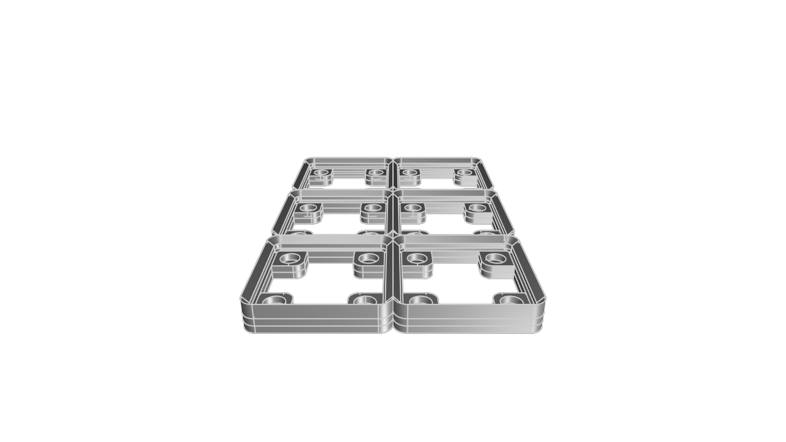
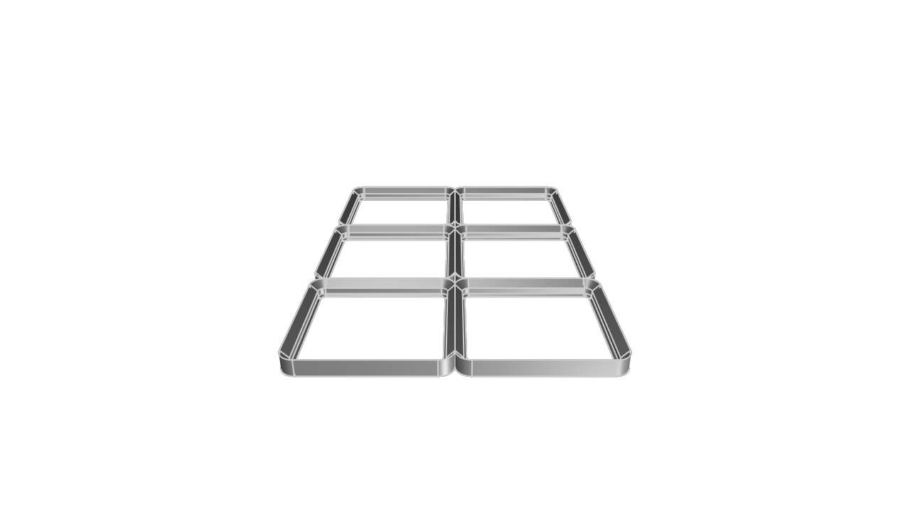
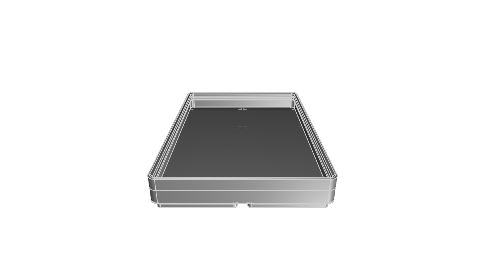
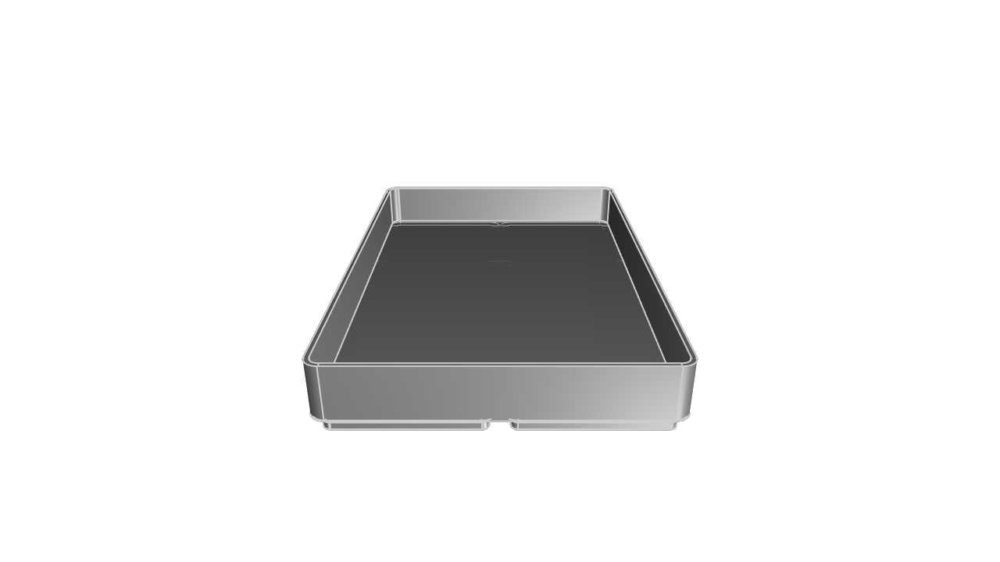

# kcl-samples

KittyCAD Language (KCL) is our language for defining geometry and working with our Geometry Engine efficiently.

This repository includes a mixture of simple and complex models demonstrating the features and syntax of KCL.

The samples can be browsed in our documentation at <https://zoo.dev/docs/kcl-samples>.

## Guidelines for adding samples

Merge PRs to the `next` branch, not main. When we release Modeling App, we will merge this repo's `next` into `main`. This way, `main` is always compatible with the latest ZMA release.

KCL samples conform to a set of style guidelines to ensure consistency and readability.

1. **File Naming:** Name your KCL files descriptively and concisely, using hyphens to separate words (e.g., flange.kcl, ball-bearing.kcl).

2. **File Header:** Include a title comment at the top of each file, followed by a brief description explaining what the model is and its typical use cases.

3. **Inline Comments:** Use inline comments to explain non-obvious parts of the code. Each major section should have a comment describing its purpose.

4. **Constants:** Define constants at the beginning of your KCL files for any values that might change or need to be reused (e.g., dimensions, angles).

## Snapshot and export

When you submit a PR to add or modify KCL samples, images and STEP files will be generated and added to the repository automatically.

---
#### [color-cube](color-cube/main.kcl) ([step](step/color-cube.step)) ([screenshot](screenshots/color-cube.png))

#### [enclosure](enclosure/main.kcl) ([step](step/enclosure.step)) ([screenshot](screenshots/enclosure.png))

#### [focusrite-scarlett-mounting-bracket](focusrite-scarlett-mounting-bracket/main.kcl) ([step](step/focusrite-scarlett-mounting-bracket.step)) ([screenshot](screenshots/focusrite-scarlett-mounting-bracket.png))

#### [gear-rack](gear-rack/main.kcl) ([step](step/gear-rack.step)) ([screenshot](screenshots/gear-rack.png))

#### [gridfinity-baseplate-magnets](gridfinity-baseplate-magnets/main.kcl) ([step](step/gridfinity-baseplate-magnets.step)) ([screenshot](screenshots/gridfinity-baseplate-magnets.png))

#### [gridfinity-baseplate](gridfinity-baseplate/main.kcl) ([step](step/gridfinity-baseplate.step)) ([screenshot](screenshots/gridfinity-baseplate.png))

#### [gridfinity-bins-stacking-lip](gridfinity-bins-stacking-lip/main.kcl) ([step](step/gridfinity-bins-stacking-lip.step)) ([screenshot](screenshots/gridfinity-bins-stacking-lip.png))

#### [gridfinity-bins](gridfinity-bins/main.kcl) ([step](step/gridfinity-bins.step)) ([screenshot](screenshots/gridfinity-bins.png))

#### [kitt](kitt/main.kcl) ([step](step/kitt.step)) ([screenshot](screenshots/kitt.png))

