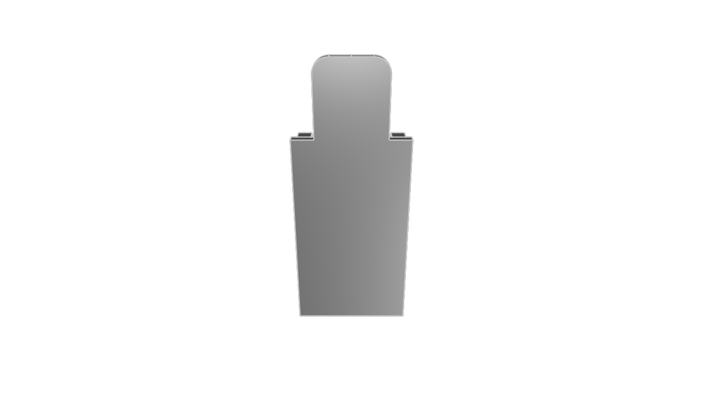
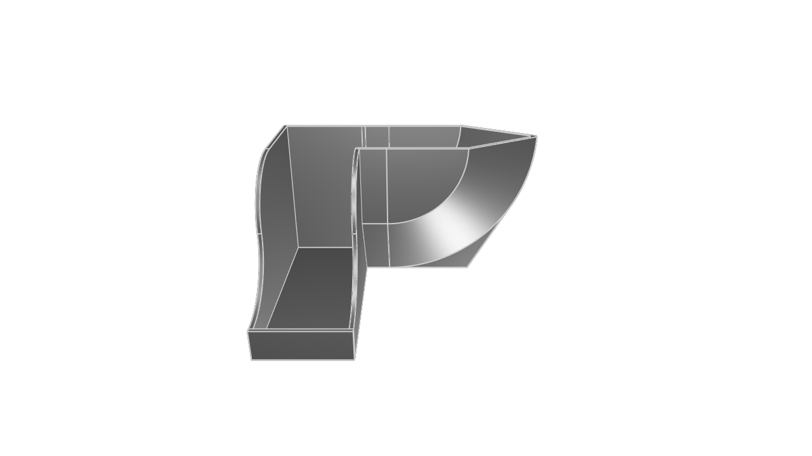
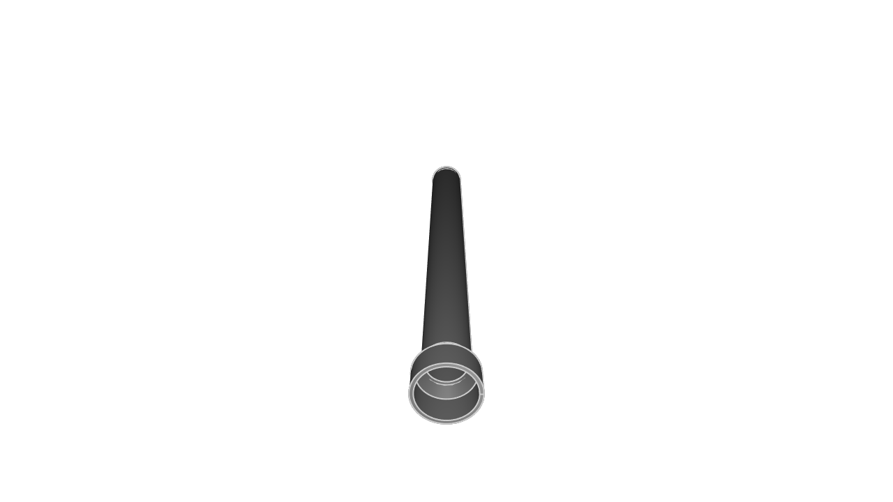

# kcl-samples

KittyCAD Language (KCL) is our language for defining geometry and working with our Geometry Engine efficiently.

This repository includes a mixture of simple and complex models demonstrating the features and syntax of KCL.

The samples can be browsed in our documentation at <https://zoo.dev/docs/kcl-samples>.

## Guidelines for adding samples

KCL samples conform to a set of style guidelines to ensure consistency and readability.

1. **File Naming:** Name your KCL files descriptively and concisely, using hyphens to separate words (e.g., flange.kcl, ball-bearing.kcl).

2. **File Header:** Include a title comment at the top of each file, followed by a brief description explaining what the model is and its typical use cases.

3. **Inline Comments:** Use inline comments to explain non-obvious parts of the code. Each major section should have a comment describing its purpose.

4. **Constants:** Define constants at the beginning of your KCL files for any values that might change or need to be reused (e.g., dimensions, angles).

## Snapshot and export

When you submit a PR to add or modify KCL samples, images and STEP files will be generated and added to the repository automatically.

---
#### [ball-bearing](./ball-bearing/ball-bearing.kcl) ([step](step/ball-bearing.step)) ([screenshot](screenshots/ball-bearing.png))

#### [brake-caliper](./brake-caliper/brake-caliper.kcl) ([step](step/brake-caliper.step)) ([screenshot](screenshots/brake-caliper.png))

#### [car-wheel-assembly](./car-wheel-assembly/car-wheel-assembly.kcl) ([step](step/car-wheel-assembly.step)) ([screenshot](screenshots/car-wheel-assembly.png))

#### [hex-nut](./hex-nut/hex-nut.kcl) ([step](step/hex-nut.step)) ([screenshot](screenshots/hex-nut.png))

#### [80-20-rail](./80-20-rail/80-20-rail.kcl) ([step](step/80-20-rail.step)) ([screenshot](screenshots/80-20-rail.png))

#### [tire](./tire/tire.kcl) ([step](step/tire.step)) ([screenshot](screenshots/tire.png))

#### [router-template-slate](./router-template-slate/router-template-slate.kcl) ([step](step/router-template-slate.step)) ([screenshot](screenshots/router-template-slate.png))

#### [flange-with-patterns](./flange-with-patterns/flange-with-patterns.kcl) ([step](step/flange-with-patterns.step)) ([screenshot](screenshots/flange-with-patterns.png))

#### [focusrite-scarlett-mounting-bracket](./focusrite-scarlett-mounting-bracket/focusrite-scarlett-mounting-bracket.kcl) ([step](step/focusrite-scarlett-mounting-bracket.step)) ([screenshot](screenshots/focusrite-scarlett-mounting-bracket.png))

#### [lug-nut](./lug-nut/lug-nut.kcl) ([step](step/lug-nut.step)) ([screenshot](screenshots/lug-nut.png))

#### [lego](./lego/lego.kcl) ([step](step/lego.step)) ([screenshot](screenshots/lego.png))

#### [bracket](./bracket/bracket.kcl) ([step](step/bracket.step)) ([screenshot](screenshots/bracket.png))

#### [sheet-metal-bracket](./sheet-metal-bracket/sheet-metal-bracket.kcl) ([step](step/sheet-metal-bracket.step)) ([screenshot](screenshots/sheet-metal-bracket.png))

#### [washer](./washer/washer.kcl) ([step](step/washer.step)) ([screenshot](screenshots/washer.png))

#### [a-parametric-bearing-pillow-block](./a-parametric-bearing-pillow-block/a-parametric-bearing-pillow-block.kcl) ([step](step/a-parametric-bearing-pillow-block.step)) ([screenshot](screenshots/a-parametric-bearing-pillow-block.png))

#### [kitt](./kitt/kitt.kcl) ([step](step/kitt.step)) ([screenshot](screenshots/kitt.png))

#### [poopy-shoe](./poopy-shoe/poopy-shoe.kcl) ([step](step/poopy-shoe.step)) ([screenshot](screenshots/poopy-shoe.png))

#### [router-template-cross-bar](./router-template-cross-bar/router-template-cross-bar.kcl) ([step](step/router-template-cross-bar.step)) ([screenshot](screenshots/router-template-cross-bar.png))

#### [mounting-plate](./mounting-plate/mounting-plate.kcl) ([step](step/mounting-plate.step)) ([screenshot](screenshots/mounting-plate.png))

#### [pipe-flange-assembly](./pipe-flange-assembly/pipe-flange-assembly.kcl) ([step](step/pipe-flange-assembly.step)) ([screenshot](screenshots/pipe-flange-assembly.png))

#### [gear-rack](./gear-rack/gear-rack.kcl) ([step](step/gear-rack.step)) ([screenshot](screenshots/gear-rack.png))

#### [socket-head-cap-screw](./socket-head-cap-screw/socket-head-cap-screw.kcl) ([step](step/socket-head-cap-screw.step)) ([screenshot](screenshots/socket-head-cap-screw.png))

#### [wheel-rotor](./wheel-rotor/wheel-rotor.kcl) ([step](step/wheel-rotor.step)) ([screenshot](screenshots/wheel-rotor.png))

#### [gear](./gear/gear.kcl) ([step](step/gear.step)) ([screenshot](screenshots/gear.png))

#### [car-wheel](./car-wheel/car-wheel.kcl) ([step](step/car-wheel.step)) ([screenshot](screenshots/car-wheel.png))

#### [pipe](./pipe/pipe.kcl) ([step](step/pipe.step)) ([screenshot](screenshots/pipe.png))

#### [flange-xy](./flange-xy/flange-xy.kcl) ([step](step/flange-xy.step)) ([screenshot](screenshots/flange-xy.png))

